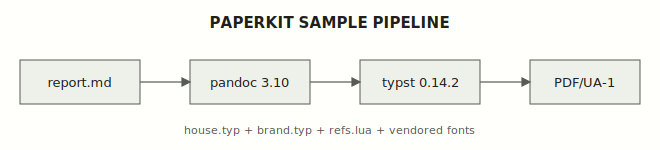

# paperkit sample document

## Summary

This document is paperkit's own integration test. CI renders it with `render.sh`
and gates the result with `check_render.py`; if any mechanism in the kit regresses —
title promotion, citation links, figure text, font embedding — this document fails
loudly before any consumer repo ever sees the breakage [1].

- **Title promotion** — this file has no `title:` front matter; the leading H1 above
  became the PDF `/Title` and the styled title heading via `refs.lua`.
- **Internal citations** — markers like [1] and [2] become links to anchors in the
  References section; a marker with no matching entry fails the compile.
- **Figure text** — Figure 1 is a hand-authored SVG whose text names DejaVu Sans,
  the same family matplotlib figures use in production documents.
- **Typography** — body is Geist (*italic*, **bold**, and ***bold italic*** exercise
  the vendored cuts), headings are Literata SemiBold, and code is Geist Mono.

## The pipeline under test

Markdown stays the source of truth — readable in the repo, rendered by GitHub — and
typst owns presentation. Pandoc bridges the two, with `refs.lua` doing the
document-shape work at the AST layer [2]. The running header on page 2 of this PDF
is the hydra package reading the current section in real time; it is consumed from
`vendor/` rather than the network, so a fresh checkout renders offline.



The interface is deliberately small — two commands, no flags to remember:

```sh
./bootstrap.sh                       # installs the pinned typst once
./render.sh sample/sample.md         # markdown in, PDF/UA-1 out
python3 check_render.py sample/sample.pdf --min-pages 2 \
  --require-font Geist --require-font Literata --require-font DejaVuSans
```

Consumers never run these in CI directly; their workflows fetch a pinned release
tarball of this repository and use the same three files the commands above use.
See the [project README](../README.md) for the consumer install — that link is
itself a test: sibling-markdown links render as plain text in the PDF, because a
PDF cannot resolve them, while staying clickable on GitHub.

What `refs.lua` actually does deserves spelling out, because it is the part of
the pipeline that owns document *shape* rather than appearance. First, if no
front-matter title exists, it promotes the leading H1 into the document title —
both the PDF `/Title` metadata and the styled title heading come from that one
move. Second, it scans running text for `[N]` markers and rewrites each into an
internal link pointing at the matching entry in the References section, which it
has wrapped in an anchor; a marker with no anchor becomes an unresolved label,
and the compile fails with a named error rather than shipping a broken citation.
Third, it strips links that point at sibling markdown files, keeping their text.

This paragraph continues the same section deliberately: it pushes the section
across the page boundary, so the page you are now reading opens mid-section and
the running header above must display the section's name. That header is itself
asserted by CI — the check script looks for the uppercase header text in the
extracted PDF text, so if hydra ever stops rendering it, the self-test fails
rather than quietly shipping headerless documents.

## Why the checks exist

typst never fails on a missing font: version 0.14 prints a warning, exits zero, and
ships a PDF typeset in its embedded fallback face. A wrong-font PDF is invisible to
exit codes, which is why `check_render.py` asserts that the embedded fonts actually
include every required family, and why each figure earns a sentinel string proving
its text survived as text rather than vanishing in a silent fallback [3].

The same philosophy applies to accessibility: the PDF is exported with
`--pdf-standard=ua-1`, and typst enforces the machine-checkable rules of that
standard at compile time — a missing document title or a broken heading hierarchy
is a build failure, not a latent defect. Accessibility is a property the pipeline
constructs, not one it hopes for.

Everything above also pads this document past one page on purpose: the running
section header only appears from page 2 onward, so a sample that fit on a single
page would leave hydra untested. If you are reading the PDF, the header above this
paragraph should read like quiet mono furniture, set in muted Geist Mono capitals
over a hairline rule, naming the section you are in — and it should have appeared
on this page without being visible on page 1. The bare URL
https://github.com/joshuaiokua/paperkit should render as a clickable link here and
in the references below, courtesy of `autolink_bare_uris`.

## References

- [1] paperkit — repository and consumer documentation.
  https://github.com/joshuaiokua/paperkit
- [2] Pandoc User's Guide — Typst output and Lua filters.
  https://pandoc.org/MANUAL.html
- [3] typst documentation — font handling and PDF standards.
  https://typst.app/docs
